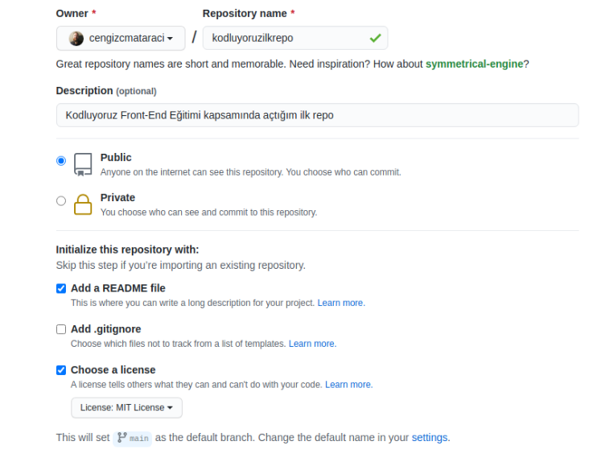

# kodluyoruzilkrepo
---------------------
Kodluyoruz Eğitimi kapsamında açtığım ilk repo.İçerisinde bir adet README.md bir adet index.html dosyası bulunuyor.
## Installation
----------------------
Öncelikle projeyi clonelayın. (Buraya sizin reponuzdan aldığınız link gelecek)

(https://github.com/melihdogukanbaydar/kodluyoruzilkrepo)
## Usage
---------------------
Projeyi cloneladıktan sonra Visiual Studio Code programında açınız

Linux için :
 cd kodluyoruzilkrepo
 cd .
 ## Contributing
 --------------------
 Pull requestler kabul edilir.Büyük değişiklikler için,lütfen önce değiştirmek istediğiniz konu ile ilgili bir tartışma açınız.

## lİCENSE
---------------------
[MIT](https://choosealicense.com/licenses/mit/)

## Proje Resmi
--------------------

